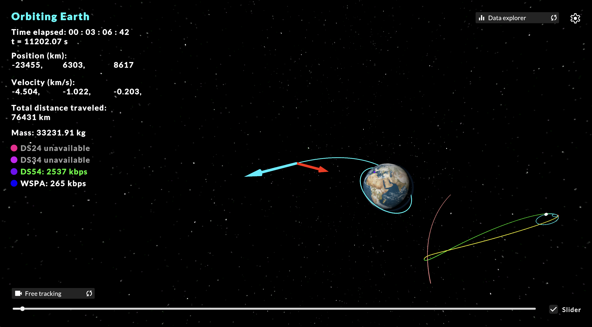
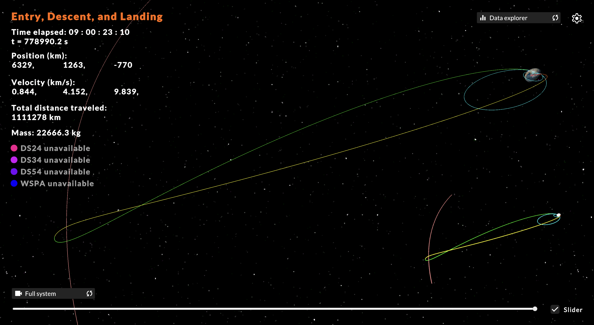
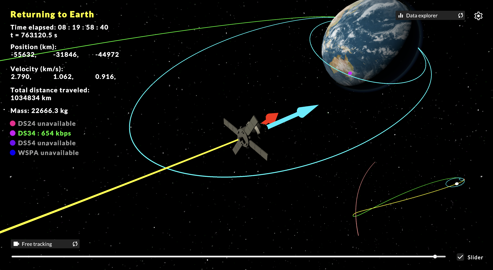
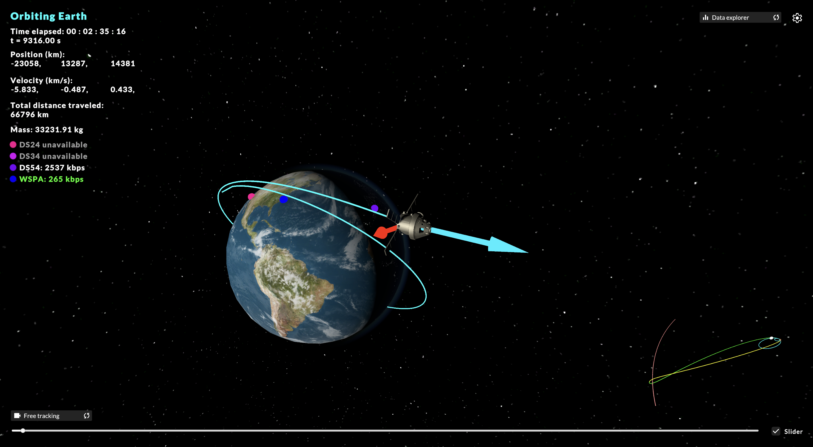

# NASA ADC 2025

A submission from Team CSC - Prospect High School's Computer Science Club

Try the web version: https://matthewlundeen.itch.io/nasa-adc-2025

## Demonstration

## Team members
* Albert Kim
* Christopher Pawlak
* Efe Ozalp
* Matthew Lundeen
* Oliver Lach
* Sharul Shah

## Creating using:
Unity Personal Edition  
GitHub  
Visual Studio Code  

## External assests
Moon texture (mapped onto our own sphere model): https://www.cgtrader.com/free-3d-models/space/planet/8k-photo-realistic-moon  
Stars skybox: https://assetstore.unity.com/packages/3d/environments/sci-fi/planet-earth-free-23399  
Earth textures: https://www.solarsystemscope.com/textures/  
Orion spacecraft: https://www.thingiverse.com/thing:5746140  
Space Launch System: https://nasa3d.arc.nasa.gov/detail/sls-ivv  

All another assets or code is either a default part of the Unity game engine or of our own creation.
